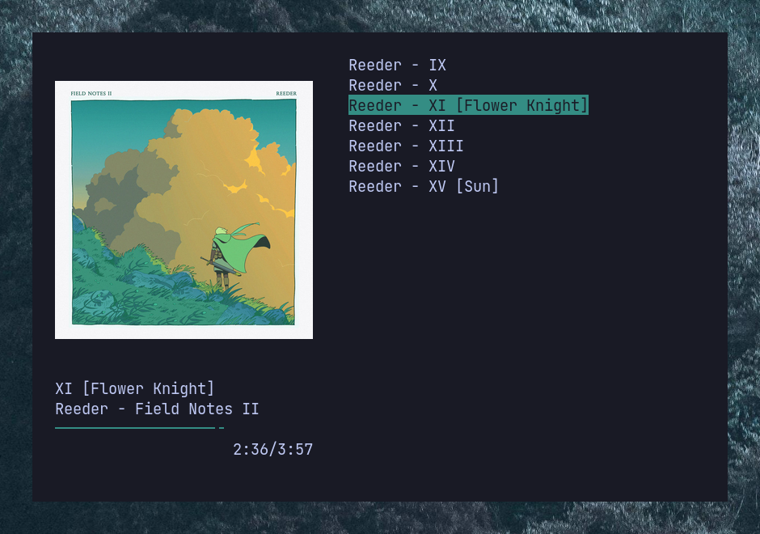

# Miniplayer

A curses based mpd client with basic functionality and album art.


After installation, the player can be opened from the terminal with `miniplayer`.

## Installation

This package can be installed by:
1. Cloning this repository to your computer and running
```
python setup.py install
```
2. Through PyPi with
```
pip install miniplayer
```
3. By installing the `miniplayer-git` package with your AUR package manager of choice.

## Configuration

The config file is located at `~/.config/miniplayer/config`. The example configuration file, [`config.example`](config.example), has all the default values. You will need to create the file yourself.

### player
Wow, that volume step is huge. Why isn't my album art centered?

| Option         | Description                                                                                           |
| -------------- | ----------------------------------------------------------------------------------------------------- |
| font_width     | The width of your font in pixels in the actual terminal.                                              |
| font_height    | The height of your font in pixels in the actual terminal.                                             |
| volume_step    | The ammount (in percents) the volume will be adjusted on pressing the volume up and volume down keys. |
| album_art_only | Whether or not to only draw the album art and no other track info (`true/false`).                     |
| auto_close     | Whether or not to automatically close the player once the mpd playlist has concluded (`true/false`).  |
| show_playlist  | Whether or not to show the playlist view.                                                             |

The `font_width` and `font_height` options are used to center the album art properly.Here is an example of how they should be measured.


### art
Why listen to music if you can't look at the pretty album art?

| Option               | Description                                                                                   |
| -------------------- | --------------------------------------------------------------------------------------------- |
| image_method         | The method to use for drawing album art. Available values are `pixcat` and `ueberzug`.        |

### mpd
Tell me your mpd address please!

| Option | Description      |
| ------ | ---------------- |
| host   | The mpd host     |
| port   | The mpd port     |
| pass   | The mpd password |


### keybindings
This section allows you to change the keybinds for the player. The format for a keybind is `key = action` (for example `p = play_pause` or `left = last_track`). 

To use `shift` as a modifier, capitalize the keybinding (i.e. `shift + p` becomes `P` and `shift + left` becomes `Left`). **This only works for alpha keys and the arrow keys!**

| Available actions |
| ----------------- |
| `play_pause`      |
| `next_track`      |
| `last_track`      |
| `volume_down`     |
| `volume_up`       |
| `toggle_info`     |
| `help`            |
| `quit`            |
| `select_down`     |
| `select_up`       |
| `select`          |
| `move_up`         |
| `move_down`       |
| `shuffle`         |
| `repeat`          |
| `delete`          |


### theme
Make it yours!

| Option       | Description                                                |
| ------------ | ---------------------------------------------------------- |
| accent_color | The color to use for selections in the playlist            |
| bar_color    | The color for the progress bar                             |
| time_color   | The color for the time stamp                               |
| bar_body     | A single character to use for the body of the progress bar |
| bar_head     | A single character to use for the head of the progress bar |

The following terminal colors can be used:
* `black`
* `red`
* `green`
* `yellow`
* `blue`
* `magenta`
* `cyan`
* `white`

You can also use the magic colour called `auto`. If you pick it, the player will try to determine the dominant color in the album art and use that instead.


## Default keybinds

| Key          | Function                           |
| ------------ | ---------------------------------- |
| h            | Show keybinds                      |
| p            | Play/pause                         |
| >            | Next track                         |
| <            | Last track                         |
| q            | Quit                               |
| +            | Volume up                          |
| -            | Volume down                        |
| i            | Toggle info                        |
| Up           | Selection up                       |
| Down         | Selection down                     |
| Enter        | Play selected song                 |
| Delete       | Remove selected song from playlist |
| Shift + up   | Move selected song up              |
| Shift + down | Move selected song down            |
| x            | Shuffle playlist                   |
| r            | Toggle repeat                      |

These keybinds can be changed by editing the config file. See the [`config.example`](config.example) file for the format.
    

## F.A.Q.
- **Q:** Album art is not showing up.  
   **A:** Try changing `image_method` from `pixcat` to `ueberzug` or vice versa.

- **Q:** Album art is too big/too small.  
   **A:** You need to configure `font_height` and `font_width`. Their values should be the actual pixel height and width of a character in your terminal.


## More screenshots!


